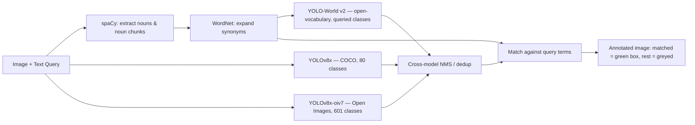

# Multimodal Perception Framework for Cross-Domain Entity Localization

Find *only the objects you asked for* in an image — not every object in it.

Type a natural-language query like `"find the banana"`, upload any photo, and the system runs three independent detection models in parallel, merges their outputs, and highlights only the objects that match your query — with everything else shown faded out for context.


---

## Why this exists

Standard object detectors (YOLO, Faster R-CNN, etc.) return a fixed list of classes and detect *everything* in the image. That's rarely what a user actually wants — most of the time you're looking for one specific thing described in plain English, and the object might not even be in the model's training vocabulary.

This project bridges that gap: it takes a free-text query, expands it linguistically (synonyms, noun phrases), runs it against **three complementary detection backbones** so vocabulary gaps in one model are covered by another, deduplicates overlapping detections across models, and returns only the query-relevant results.

## How it works



**Three models, three jobs:**

| Model | Vocabulary | Role |
|---|---|---|
| YOLOv8x | 80 COCO classes | High-accuracy detection for common objects |
| YOLOv8x-oiv7 | 601 Open Images classes | Covers fine-grained categories COCO misses (food, fruit, body parts, etc.) |
| YOLO-World v2 | Unbounded (open-vocabulary) | Detects whatever nouns the query mentions, even if neither fixed model was trained on that class |

**Query understanding pipeline:**
1. spaCy extracts nouns and noun phrases from the query
2. WordNet expands each noun into its synonym set (so "auto" also matches "car")
3. The expanded noun list is fed directly into YOLO-World's `set_classes()` at inference time
4. Detections from the two fixed-vocabulary models are matched against the same expanded term set

**Merging results:**
All detections from all three models are pooled, then a custom IoU-based non-max suppression pass removes duplicate boxes across models (e.g. if both YOLOv8x and YOLO-World both find the same banana, only the higher-confidence box survives). Matched detections are drawn with a bold green box and confidence label; everything else is drawn faint and unlabeled, so the output image reads at a glance.

## Tech stack

`Python` · `Flask` · `Ultralytics YOLOv8` · `YOLO-World v2` · `spaCy` · `NLTK WordNet` · `OpenCV` · `NumPy`

## Getting started

```bash
git clone https://github.com/<your-username>/multimodal-entity-localization.git
cd multimodal-entity-localization
pip install -r requirements.txt
python -m spacy download en_core_web_sm
python app.py
```

Then open `http://127.0.0.1:5000`, upload an image, type a description, and run.

> Note: the three YOLO checkpoints (`yolov8x.pt`, `yolov8x-oiv7.pt`, `yolov8x-worldv2.pt`) download automatically via Ultralytics on first run. They're large (~130MB each) — expect a delay the first time.

## Project structure

```
├── app.py                  # Flask app + full detection pipeline
├── requirements.txt
├── templates/
│   └── index.html          # Upload form + results UI
└── static/
    ├── uploads/             # User-submitted images (gitignored)
    └── outputs/             # Annotated results (gitignored)
```

## Design decisions worth asking about

- **Why three models instead of one?** No single fixed-vocabulary model covers every object a user might describe. Running a COCO model, an Open Images model, and an open-vocabulary model in parallel trades some compute for much broader real-world coverage, without retraining anything.
- **Why cross-model NMS instead of just picking one model's output?** Overlapping detections from different backbones on the same object would otherwise show duplicate boxes. IoU-based suppression keeps only the highest-confidence box per real-world object regardless of which model found it.
- **Why WordNet synonym expansion?** A query like "find the auto" should still match a detector's "car" label. Expanding the query into a synonym set closes that vocabulary gap without needing a fine-tuned language-vision model.
- **Known limitation:** running all three models sequentially on CPU is not fast enough for real-time use — this is a correctness-first proof of concept, not a production inference service. GPU inference and model result caching would be the first steps toward that.

## Future improvements

- Swap sequential CPU inference for batched GPU inference to cut latency
- Add confidence calibration across models (their score scales aren't directly comparable)
- Replace WordNet expansion with a small sentence-embedding similarity check for more robust matching
- Add automated tests around the NMS merge logic and query parsing

## Authors

Built as a final-year B.Tech project (AI & Data Science) by Shaheen Thamanna B, Helsiyah Salomi B, and Muskaan Fathima S.
